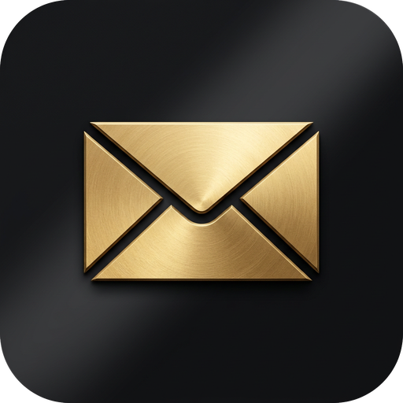

# @marlinjai/email-mcp

<p align="center"></p>

A unified MCP server for email access across Gmail, Outlook, iCloud, and generic IMAP providers.

## Features

- **Multi-provider support** -- Gmail (REST API), Outlook (Microsoft Graph), iCloud (IMAP), and generic IMAP/SMTP
- **OAuth2 authentication** -- Browser-based OAuth flows for Gmail and Outlook, with automatic token refresh
- **Full email client** -- Search, read, send, reply, forward, organize, and manage drafts
- **Batch operations** -- Delete, move, or mark hundreds of emails in a single call
- **Lightweight search** -- Compact search results by default (~20KB vs ~1.4MB) with optional full body retrieval
- **Encrypted credential storage** -- AES-256-GCM encryption at rest with machine-derived keys
- **Provider-native APIs** -- Uses Gmail API and Microsoft Graph where available for richer features, falls back to IMAP for universal compatibility

## Installation

Install globally from npm:

```bash
npm install -g @marlinjai/email-mcp
```

Or run directly with npx (no install needed):

```bash
npx @marlinjai/email-mcp
```

## Quick Start

1. Run the interactive setup wizard to add your email accounts:

```bash
npx -y -p @marlinjai/email-mcp@latest email-mcp-setup
```

> **The `-p`/`--package` flag is required.** This package declares two binaries (`email-mcp` for the MCP server, `email-mcp-setup` for this wizard). Without `-p`, npx runs the bin matching the *package's own name* (`email-mcp`, the server) and silently passes `email-mcp-setup` to it as an ignored argument — the server then sits waiting for MCP protocol input on stdin forever, producing no output at all. It looks exactly like a hang. `-p` tells npx explicitly which package to resolve and which of its binaries to actually run.

The wizard will walk you through provider selection and authentication. After each account, it asks if you'd like to add another — so you can set up Gmail, Outlook, and iCloud all in one go.

2. Add the server to your MCP configuration (`.mcp.json`):

```json
{
  "mcpServers": {
    "email": {
      "command": "npx",
      "args": ["@marlinjai/email-mcp"]
    }
  }
}
```

3. Start using email tools in Claude Code — search your inbox, send emails, organize messages, and more.

## Provider Setup Guides

### Gmail

No configuration needed — the setup wizard handles everything using built-in OAuth credentials (PKCE):

```bash
npx -y -p @marlinjai/email-mcp@latest email-mcp-setup
# Select "Gmail" when prompted
# Choose "Full" or "Restricted" permission scope when asked
# A browser window opens for Google authorization
# Grant the requested permissions and return to the terminal
```

The wizard asks which Gmail permission scope to authorize:

- **Full** (default) — everything below, plus immediate, Trash-bypassing permanent deletion (`https://mail.google.com/`, Gmail's maximum-permission scope).
- **Restricted** — read, send, label, archive, and move-to-trash (`gmail.modify` + `gmail.settings.basic`), but no permanent deletion. Every tool in this server works identically under Restricted except an explicit `permanent: true` delete, which fails with a Gmail API error instead of succeeding.

Pass `--scope full` or `--scope restricted` to skip the prompt, or set `EMAIL_MCP_GMAIL_SCOPE=restricted` in the environment the wizard runs in.

> **Verification status (1 October 2026):** Google's review of the shared OAuth app is still running, so Google currently only lets accounts on its test-user list sign in through it; everyone else sees the "has not completed the Google verification process" screen and needs their own OAuth app (next note). The last open step for the shared app is a yearly independent security assessment (CASA, Cloud Application Security Assessment) that Google has requested. Because email-mcp has no server of its own, its applicability is being clarified with Google. Details and current status: [email.lumitra.co/privacy#google-verification](https://email.lumitra.co/privacy#google-verification), tracked in [issue #1](https://github.com/marlinjai/email-mcp/issues/1).

> **Note:** If you prefer to use your own OAuth app instead of the shared one this package ships with, create a Desktop OAuth 2.0 Client in the [Google Cloud Console](https://console.cloud.google.com/) with the Gmail API enabled, then set `EMAIL_MCP_GMAIL_CLIENT_ID` and `EMAIL_MCP_GMAIL_CLIENT_SECRET` in the environment before running the setup wizard (and in the MCP server's environment, since re-authentication uses the same variables). This gives you your own token lifecycle, independent of the publisher's Cloud project, and sidesteps Google's unverified-app warning and 100-test-user cap for your own account(s) once you add yourself as a test user on your own app.

### Outlook

No configuration needed — the setup wizard handles everything using built-in OAuth credentials (PKCE):

```bash
npx -y -p @marlinjai/email-mcp@latest email-mcp-setup
# Select "Outlook" when prompted
# A browser window opens for Microsoft authorization
# Sign in and grant the requested permissions
```

> **Note:** If you prefer to use your own OAuth app, register one in the [Azure Portal](https://portal.azure.com/) with `Mail.ReadWrite`, `Mail.Send`, `MailboxSettings.ReadWrite` (needed for `email_create_block_rule`), and `offline_access` permissions, then set `EMAIL_MCP_OUTLOOK_CLIENT_ID` in the environment before running the setup wizard.

### iCloud

1. Go to [appleid.apple.com](https://appleid.apple.com/) and sign in.
2. Navigate to **App-Specific Passwords** and generate a new password.
3. Run the setup wizard:

```bash
npx -y -p @marlinjai/email-mcp@latest email-mcp-setup
# Select "iCloud" when prompted
# Enter your iCloud email address
# Enter the app-specific password you generated
```

### Generic IMAP

Run the setup wizard with your IMAP/SMTP server details:

```bash
npx -y -p @marlinjai/email-mcp@latest email-mcp-setup
# Select "Other IMAP" when prompted
# Enter your IMAP host, port, and credentials
# Optionally enter SMTP host and port for sending
```

## Available Tools (36)

### Account Management (4)

| Tool | Description |
|------|-------------|
| `email_list_accounts` | List all configured accounts with connection status |
| `email_add_account` | Add a new IMAP or iCloud account (Gmail/Outlook require setup wizard) |
| `email_remove_account` | Remove an account and its stored credentials; revokes the Google grant for Gmail, removes Outlook tokens from the local token cache, and reports the outcome |
| `email_test_account` | Test connection to an account |

### Reading & Searching (6)

| Tool | Description |
|------|-------------|
| `email_list_folders` | List all folders/labels for an account |
| `email_search` | Search emails with filters. Returns compact results by default (`returnBody=false`). Set `returnBody=true` to include full email bodies |
| `email_get` | Get full email content by ID (headers, body, attachment metadata). `sourceFolder` names the folder on iCloud/IMAP when the message is not in INBOX |
| `email_get_thread` | Get an entire email thread/conversation. On iCloud/IMAP a thread is searched in one folder: INBOX, or the one named in `sourceFolder` |
| `email_get_attachment` | Download a specific attachment by ID (returns base64 data). `sourceFolder` names the folder on iCloud/IMAP when the message is not in INBOX |
| `email_save_attachment` | Download an attachment directly to disk, returning metadata only, which avoids the token cost of round-tripping large files as base64. `outputPath` is relative to a fixed downloads directory (`~/.email-mcp/downloads`, override with `EMAIL_MCP_DOWNLOADS_DIR`) and cannot escape it. `sourceFolder` as on `email_get_attachment` |

### Sending & Drafts (6)

`email_send`, `email_reply`, `email_forward`, `email_draft_create` and `email_draft_update` take an optional `attachments` list. Each entry is either `{ path }` (a file in the attachments folder, see below) or `{ content, filename }` (base64), with an optional `contentType` (inferred from the extension otherwise). The total is capped at 25 MB; Outlook accepts up to 3 MB per message through this server. On `email_draft_update` a list replaces the draft's files and an empty list removes them.

Replies stay in their thread: `email_reply` sends inside the original conversation on Gmail and Outlook (and sets the `In-Reply-To` and `References` headers everywhere), `email_draft_create` with `inReplyToEmailId` saves a reply draft in that thread, and `email_draft_update` keeps a reply draft there.

**Forwarding the original message's attachments is opt-in.** `email_forward` sends the text of the original; its files go along only with `includeOriginalAttachments: true`, so one call does not pass files the assistant never looked at on to another address. Forwarded files count against the 25 MB cap together with added ones.

**Attaching files by path is off until you name a folder.** The path comes from the assistant, and an assistant that reads mail can be asked by a mail to attach something it should not (a private key, for example). So files are only read from the one folder you set in `EMAIL_MCP_ATTACHMENTS_DIR`, in the environment of the server; no tool can change it. Put the file there and ask for it by name:

```json
{
  "mcpServers": {
    "email": {
      "command": "npx",
      "args": ["@marlinjai/email-mcp"],
      "env": { "EMAIL_MCP_ATTACHMENTS_DIR": "~/Documents/email-outbox" }
    }
  }
}
```

A path outside that folder is refused, as is a symbolic link that leads out of it, and email-mcp's own data files are never attachable.

| Tool | Description |
|------|-------------|
| `email_send` | Compose and send a new email (to, cc, bcc, subject, body, attachments) |
| `email_reply` | Reply to an email in its thread. `replyAll` addresses the sender and all To/Cc recipients except your own address, each once. Optional `to`/`cc`/`bcc` overrides and `additionalRecipients`, e.g. when replying to your own sent message. Attachments supported. `sourceFolder` names the folder on iCloud/IMAP when the message is not in INBOX |
| `email_forward` | Forward an email to new recipients (`to`, `cc`, `bcc`, optional text on top, attachments). The original's attachments are left out unless `includeOriginalAttachments: true`. `sourceFolder` names the folder on iCloud/IMAP when the message is not in INBOX |
| `email_draft_create` | Save a draft without sending (attachments supported). `inReplyToEmailId` saves it as a reply inside that message's thread (`inReplyToSourceFolder` names that message's folder on iCloud/IMAP when it is not in INBOX) |
| `email_draft_update` | Update an existing draft in place. A reply draft stays in its thread. On Gmail/Outlook the draft id is unchanged; on iCloud/generic IMAP there's no in-place update (IMAP messages are immutable), so the old draft is deleted and a new one appended: the returned id is a **new** id, always use it going forward |
| `email_draft_list` | List all drafts |

### Organization (8)

| Tool | Description |
|------|-------------|
| `email_move` | Move an email to a different folder. Supports `sourceFolder` for IMAP/iCloud |
| `email_transfer` | Move or copy emails **between accounts**, preserving the original message (sender, date, threading) via raw MIME transfer. `deleteAfter=true` trashes the source only after a confirmed import (safe cross-account move) |
| `email_delete` | Delete an email (trash or permanent). Supports `sourceFolder` for IMAP/iCloud |
| `email_mark` | Mark as read/unread, starred, or flagged. Supports `sourceFolder` for IMAP/iCloud |
| `email_label` | Add/remove labels (Gmail only) |
| `email_folder_create` | Create a new folder |
| `email_get_labels` | List all labels with counts (Gmail only) |
| `email_get_categories` | List all categories (Outlook only) |

### Batch Operations (4)

| Tool | Description |
|------|-------------|
| `email_batch_delete` | Delete multiple emails at once (up to 1000 for Gmail, batches of 20 for Outlook, UID ranges for IMAP) |
| `email_batch_move` | Move multiple emails to a folder in a single call |
| `email_batch_mark` | Mark multiple emails read/unread, starred, or flagged at once |
| `email_batch_label` | Add or remove labels on multiple emails at once (native batch call on Gmail, one by one elsewhere) |

All batch tools accept a `sourceFolder` parameter for IMAP/iCloud and include a sequential fallback for maximum compatibility.

### Spam Moderation (5)

| Tool | Description |
|------|-------------|
| `email_report_spam` | Report an email as spam/junk, training the provider's own filter — the same signal the "Report Junk" button sends in Gmail/Outlook. This is different from `email_delete`, which removes the message but teaches the filter nothing. **Not** an abuse report to the provider's security team; it only trains this account's filter |
| `email_batch_report_spam` | Report multiple emails as spam/junk at once |
| `email_create_block_rule` | Create a standing rule that intercepts future mail matching a pattern (sender domain/address, subject, or arbitrary header content) and either deletes it or moves it. Use `headerContains` (e.g. a Reply-To domain) to block a spam template family whose visible "From" domain rotates — matching the rotating domain directly stops working within days. **Not supported on iCloud/generic IMAP** (no standard server-side rule mechanism exists across IMAP servers). On Outlook, `moveToJunk` files straight to the Junk Email folder and requires the `MailboxSettings.ReadWrite` scope. On Gmail, `moveToJunk` skips the inbox (archives) rather than literally filing to Spam — Gmail's filter API rejects the SPAM label on standing rules (only Gmail's own classifier can apply it; `email_report_spam` still can, since that's a direct per-message action, not a filter) — and requires the `gmail.settings.basic` scope. Accounts authenticated before these scopes existed need to re-run the setup wizard once to re-consent |
| `email_list_block_rules` | List the standing block rules on an account, for auditing or before deleting one |
| `email_delete_block_rule` | Delete a standing block rule — use to undo a rule that turned out too broad |

Gmail and Outlook only for the rule tools; `email_report_spam`/`email_batch_report_spam` work on every provider (iCloud/IMAP fall back to a best-effort move into the account's Junk-typed folder, with no vendor ML training signal since generic IMAP has none to train).

### Forwarding Rules (3)

| Tool | Description |
|------|-------------|
| `email_create_forward_rule` | Create a standing rule that forwards future mail matching a pattern (sender domain/address, subject, or header content) to another address, for example vendor invoices to a bookkeeping address. The original stays in the inbox unless `keepInInbox` is `false`. Creating the same rule twice returns the existing one |
| `email_list_forward_rules` | List every rule on an account that forwards mail elsewhere, including rules made by hand in Gmail or Outlook: an audit of where mail is being sent |
| `email_delete_forward_rule` | Delete a forwarding rule by id |

Gmail and Outlook only. iCloud and generic IMAP have no server-side rule mechanism; set the rule in the provider's own settings there.

**Forwarding is off until you allow a target.** A standing forward rule copies future mail out of your mailbox, and an assistant that reads mail can be asked to create one by the mail it reads. So `email_create_forward_rule` only accepts addresses you listed yourself in `EMAIL_MCP_FORWARD_ALLOWLIST` (comma-separated), in the environment of the server. No tool can change that list:

```json
{
  "mcpServers": {
    "email": {
      "command": "npx",
      "args": ["@marlinjai/email-mcp"],
      "env": { "EMAIL_MCP_FORWARD_ALLOWLIST": "expenses@example.com" }
    }
  }
}
```

On Gmail the target must also be a forwarding address of the account: add it once under Gmail Settings, "Forwarding and POP/IMAP", "Add a forwarding address", and confirm the email Google sends to it. Outlook needs no such step, which is why the allowlist exists. Outlook accounts authenticated before the block-rule tools existed need to re-run the setup wizard once, as for those tools.

## Usage with Claude Code

Add the following to your `.mcp.json` file (project-level or global `~/.claude/.mcp.json`):

```json
{
  "mcpServers": {
    "email": {
      "command": "npx",
      "args": ["@marlinjai/email-mcp"]
    }
  }
}
```

Once configured, you can ask Claude to interact with your email:

- "Check my inbox for unread messages"
- "Search for emails from alice@example.com in the last week"
- "Reply to the latest email from Bob and thank him"
- "Move all newsletters to the Archive folder"
- "Delete all spam emails" (uses batch operations for speed)
- "Draft a follow-up email to the team about the meeting"

## Development

```bash
# Install dependencies
pnpm install

# Build the project
pnpm build

# Run in development mode (watch for changes)
pnpm dev

# Run tests
pnpm test

# Run tests in watch mode
pnpm test:watch

# Run integration tests (requires real email accounts)
pnpm test:integration
```

## Credential Storage

Account credentials are encrypted at rest with AES-256-GCM in `~/.email-mcp/credentials.enc`.

By default the encryption key is derived from a stable, machine-specific identifier
(the hardware UUID on macOS, `/etc/machine-id` on Linux, or the `MachineGuid` on
Windows), falling back to the hostname when none is available.

Set the `EMAIL_MCP_KEY` environment variable to supply your own passphrase instead.
This is recommended when the machine identifier may change (for example in
containers or CI), or when you want to move `credentials.enc` between machines:

```bash
export EMAIL_MCP_KEY="your-strong-passphrase"
```

When `EMAIL_MCP_KEY` is set, existing credential files are transparently
re-encrypted with the passphrase the next time they are read.

The Outlook refresh token lives in the token cache of Microsoft's authentication
library (MSAL), `~/.email-mcp/msal-cache.enc`, encrypted with the same scheme and key
derivation as `credentials.enc`, so `EMAIL_MCP_KEY` protects both files. Versions before 1.8.0
kept this cache as plain JSON in `~/.email-mcp/msal-cache.json`; 1.8.0 encrypts it and
deletes the plain file the first time it reads it, without signing you out. Going back
to an older version afterwards means signing in to Outlook again.

On macOS and Linux, attachments saved with `email_save_attachment` are written
owner-only (`0600`), and folders email-mcp creates for them are `0700`. They are not
encrypted.

The OAuth sign-in callback started by `email-mcp-setup` listens on the loopback
addresses only (`127.0.0.1`, and `::1` when available), so nothing else on your network
can reach it.

## Support

email-mcp is free and has no paid tier. Its one fixed cost is the independent security assessment Google requires every year for the shared Gmail sign-in (CASA, Cloud Application Security Assessment): 675 US dollars a year. It is the last open step before Google lets everyone use the one-command Gmail setup. Donations are collected until 2 November 2026, the day the assessment has to start, and the maintainer pays what is missing then. Progress is shown at [email.lumitra.co](https://email.lumitra.co/#fund-the-audit).

- [GitHub Sponsors](https://github.com/sponsors/marlinjai)
- [Buy Me a Coffee](https://buymeacoffee.com/marlinjai)

## License

MIT
